# W10 provisional cells — owner one-pass review pack (v1)

Date: 2026-10-06. Issue: [#17](https://github.com/Yingda-Yu/Spartina-Earth/issues/17)
(owner closure comment 2026-10-06). Status:

**OWNER_SIGNOFF_REQUIRED — no decision below is final.**

This pack closes the human-review gap on the ten
`PROVISIONAL_UNRESOLVED` W10 cells that block the W10 freeze. It does
**not** redesign the domain, change any cell, or re-run the membership
rule. Every recommendation is an analyst recommendation for the owner
to accept or reject in one pass.

## How to decide

Open the machine-readable template
[`china_w10_provisional_owner_decisions_v1.csv`](../../datasets/manifests/china_w10_provisional_owner_decisions_v1.csv),
fill `owner_decision` (one of the four allowed tokens),
`owner_name`, `owner_signoff_date`, optional `owner_notes`, and return
it. Allowed decisions:

- `KEEP_MAINLAND_COASTAL`
- `KEEP_ISLAND_COASTAL`
- `EXCLUDE_DOMAIN_ARTIFACT`
- `REMAIN_PROVISIONAL`

Signed decisions will be versioned as a v1.1 rule/result; the
deterministic full-population audit is then re-run, downstream readers
migrated, and only then is a freeze recommendation issued.

## Evidence rules (unchanged from v1)

- Cell boxes are the immutable 10 km China-Albers W10 cells.
- Rule inputs: Natural Earth 10 m admin-0 ownership + GSHHS 2.3.7
  high-resolution (h) land/coastline + the parameter-locked ordered
  rule (≥100 m² Chinese-mainland touch; nearshore island ≤100 km² with
  representative point ≤25 km from the China mainland and strictly
  Chinese landfall; contested admin never auto-claimed).
- Review-only corroboration: GSHHS **full** resolution (f) land
  polygons. It is not a rule input and cannot itself flip a cell; it
  tells the owner whether the h-level "unadministered land" is a real
  island or shoreline generalization.
- Distances are measured in the project China-Albers CRS from the
  island representative point to the PRC-administered mainland; cell
  distances (rule evidence) use the cell geometry.
- **No Spartina label, model output, EO scene availability, Murray or
  JRC layer is used anywhere in this pack.**
- Formal island-name attributions from external gazetteers are marked
  `TODO_VERIFY`; the deterministic evidence (coordinates, area,
  distances, admin polygons) stands on its own.

Machine-readable evidence per cell:
[`w10_provisional_review_facts_v1.json`](w10_provisional_review_facts_v1.json).

## Group 1 — five Kinmen-archipelago cells (contested admin)

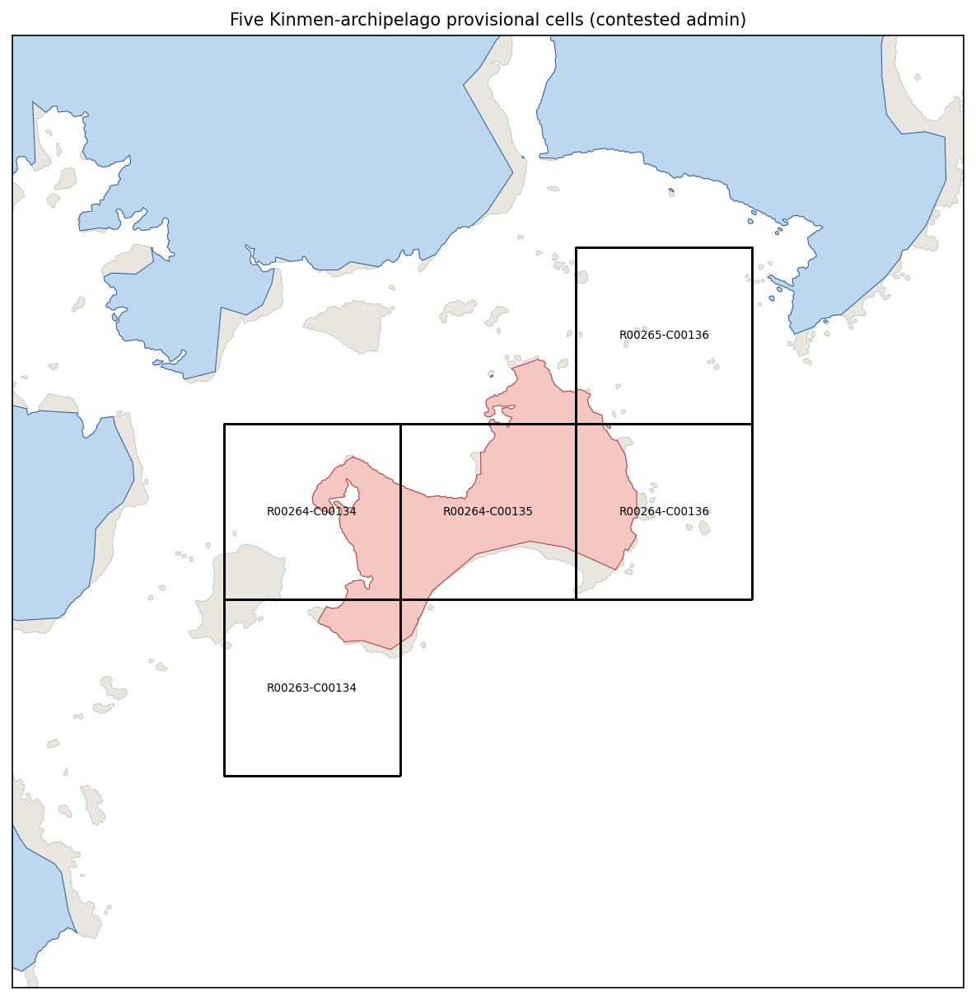

All five cells intersect the Kinmen island polygon that Natural Earth
attributes to `Taiwan` (contested unit, per project policy never folded
or silently claimed). They lie 0.9–8.9 km off the Fujian mainland;
three also contain small land pieces the deterministic v1 rule already
attributes as PRC nearshore islets. The recommendation on all five is
conditional: **KEEP_ISLAND_COASTAL only under an explicit programme
decision to include contested-admin nearshore cells with a standing
disclaimer**; the recorded alternative is EXCLUDE_DOMAIN_ARTIFACT.
Confidence is `LOW_POLICY_HIGH_GEOGRAPHY` — the geography is clear, the
choice is a programme posture, not a GIS result.

| Cell | km to mainland | Contested land (h / f) | PRC islet (h) | GSHHS land (h) | Recommendation |
|---|---:|---:|---:|---:|---|
| R00263-C00134 | 7.7 | 9.86% / 9.74% | 2.80% | 14.30% | KEEP_ISLAND_COASTAL (disclaimer) |
| R00264-C00134 | 3.0 | 23.40% / 23.74% | 9.34% | 32.78% | KEEP_ISLAND_COASTAL (disclaimer) |
| R00264-C00135 | 8.9 | 59.92% / 60.07% | 0 | 63.44% | KEEP_ISLAND_COASTAL (disclaimer) |
| R00264-C00136 | 5.6 | 22.88% / 22.74% | 0.43% | 27.41% | KEEP_ISLAND_COASTAL (disclaimer) |
| R00265-C00136 | 0.9 | 1.94% / 1.83% | 0.47% | 2.41% | KEEP_ISLAND_COASTAL (disclaimer) |

| | |
|---|---|
| 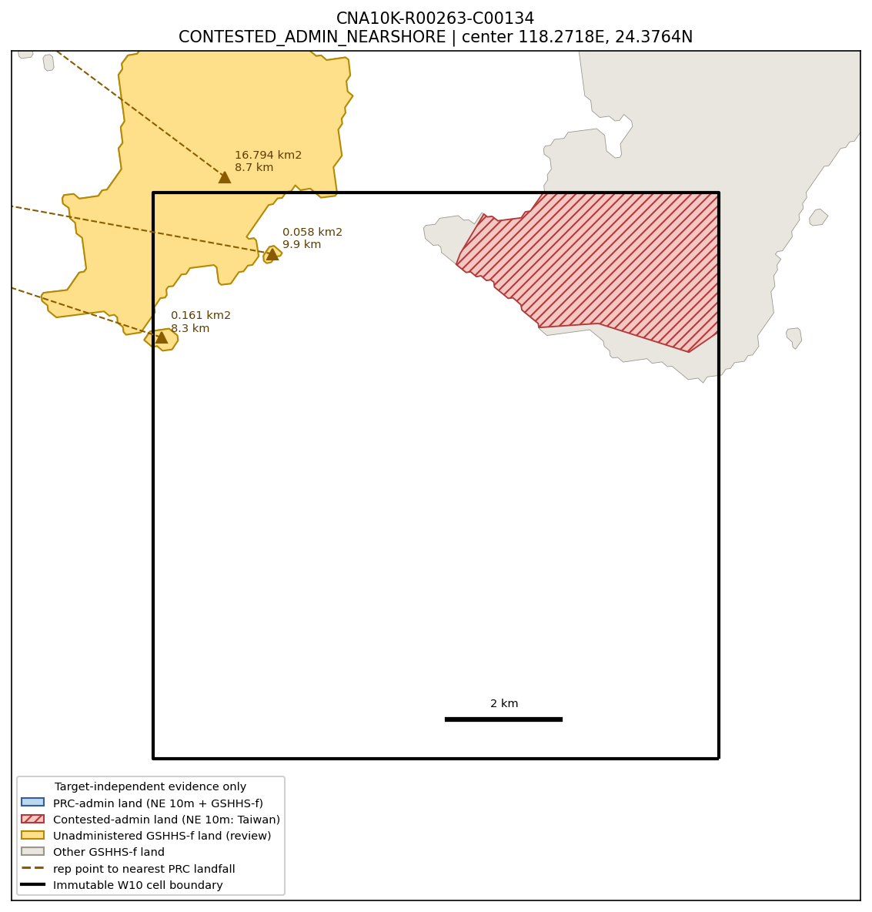 | 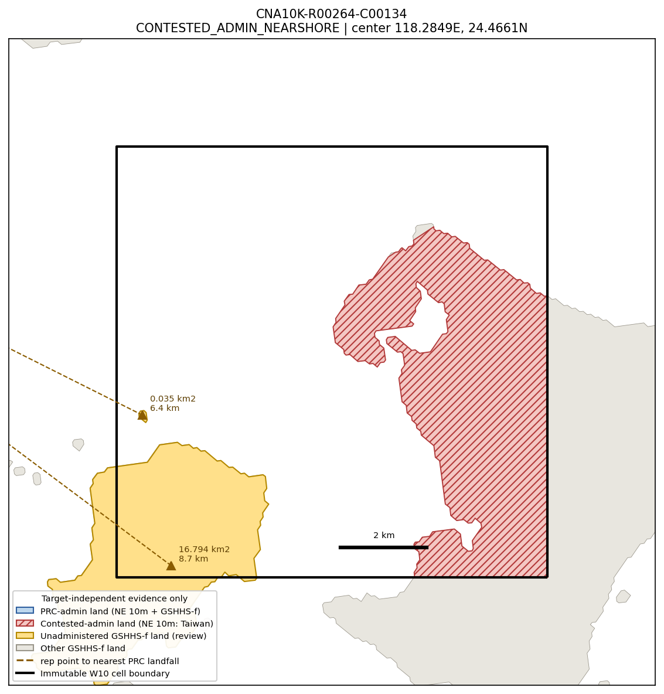 |
| 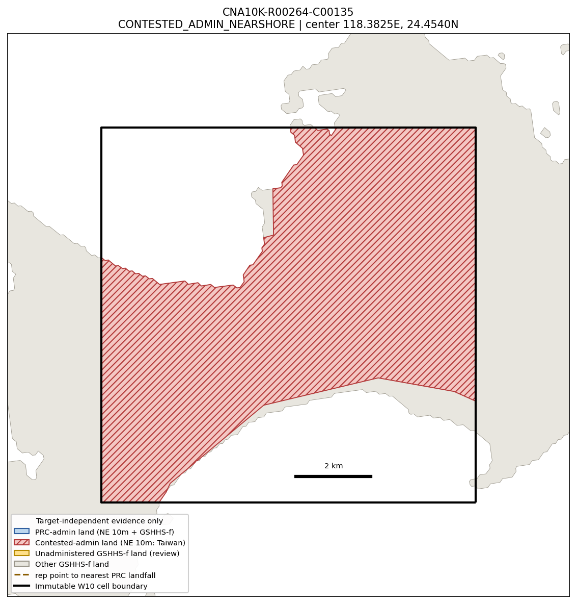 | 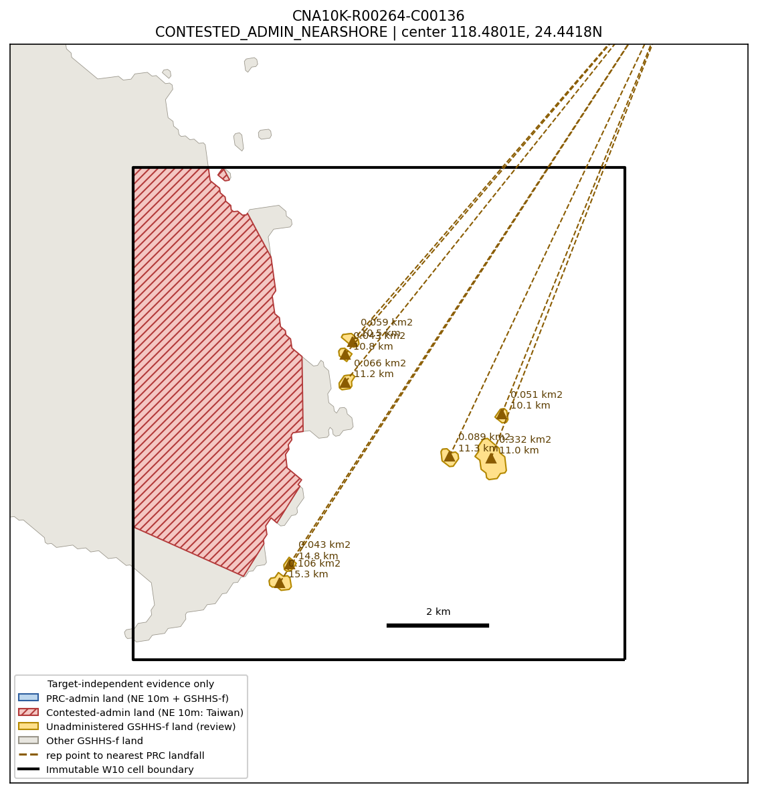 |
| 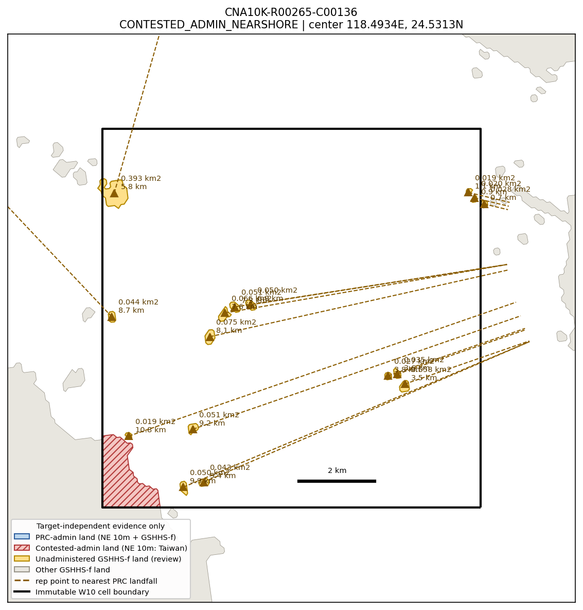 | |

**Owner policy question (answer once, applies to all five):** does the
mainland-China coastal monitoring product include Kinmen-archipelago
cells with a contested-territory disclaimer, exclude them, or hold
them out of the frozen frame?

## Group 2 — five unattributed-land cells

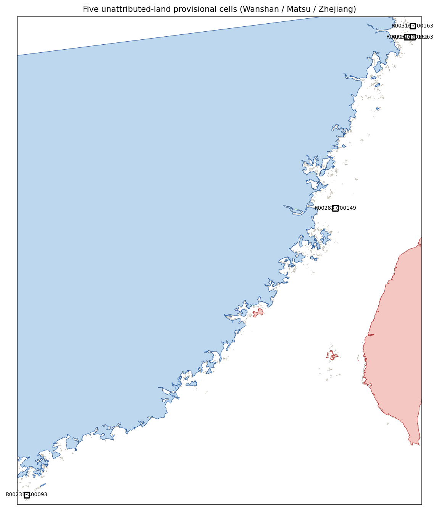

Natural Earth 10 m contains no admin polygon for the land in these
cells, and the rule's fixed 25 km nearshore-island reach is the binding
constraint. GSHHS full resolution shows the land is real, not
generalization noise.

| Cell | Center | Largest f-level land | Nearest PRC landfall | Foreign land | Recommendation | Confidence |
|---|---|---|---:|---:|---|---|
| R00231-C00093 (Pearl estuary / Wanshan setting) | 113.97E,21.90N | 2.868 km² @ 114.005E,21.860N | 27.6 km | 621.6 km | KEEP_ISLAND_COASTAL | MEDIUM |
| R00283-C00149 (Matsu channel) | 120.03E,25.97N | 2.890 km² @ 119.979E,25.959N | 27.7 km | 331.9 km | **REMAIN_PROVISIONAL** | MEDIUM |
| R00314-C00162 (Dachen setting) | 121.83E,28.53N | 9.643 km² @ 121.893E,28.494N | 25.3–27.7 km | 334.6 km | KEEP_ISLAND_COASTAL | HIGH |
| R00314-C00163 (Dachen setting) | 121.94E,28.51N | 9.643 km² @ 121.893E,28.494N | 27.7–31.1 km | 327.9 km | KEEP_ISLAND_COASTAL | HIGH |
| R00316-C00163 (Dongji setting) | 121.97E,28.69N | 2.967 km² @ 121.919E,28.715N | 26.2–27.3 km | 343.3 km | KEEP_ISLAND_COASTAL | HIGH |

Island-group names (Wanshan / Dachen / Dongji) are geographic setting
notes consistent with the measured coordinates; formal name/ownership
attribution is `TODO_VERIFY` against official island registers before
a v1.1 rule is encoded. The four KEEP recommendations require the same
owner-approved v1.1 mechanism: a **verified-offshore-island** extension
beyond the 25 km reach, applied only to full-resolution-confirmed
islands whose strictly nearest administered landfall is the PRC
mainland (foreign land is 328–622 km away in all four).

| | |
|---|---|
| 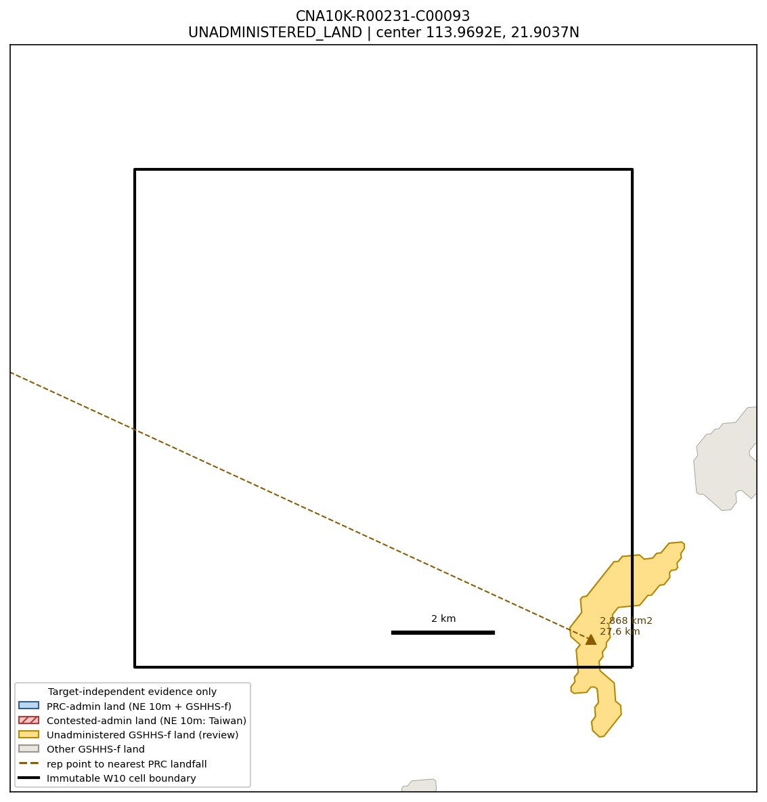 | 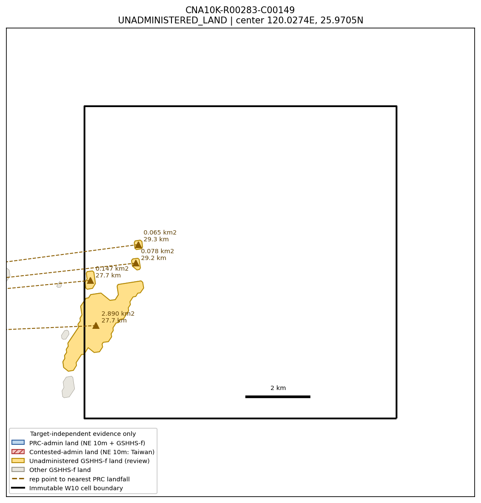 |
| 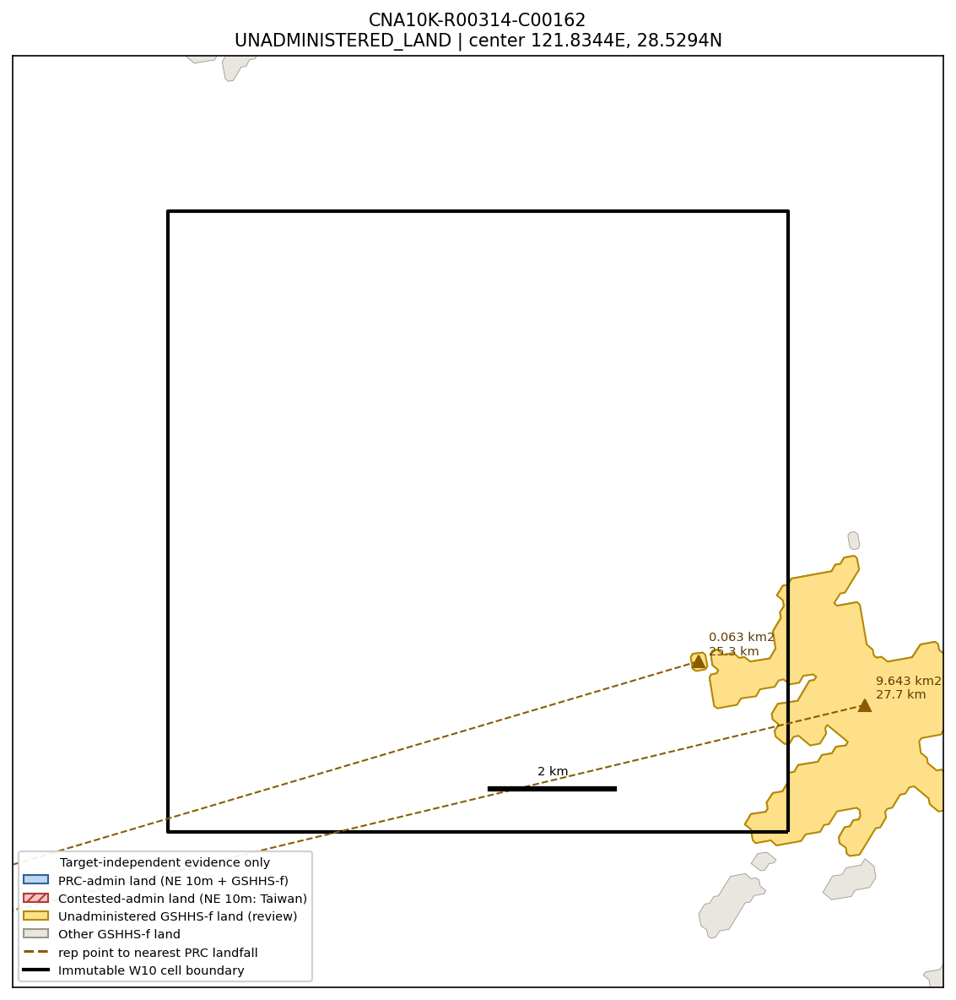 | 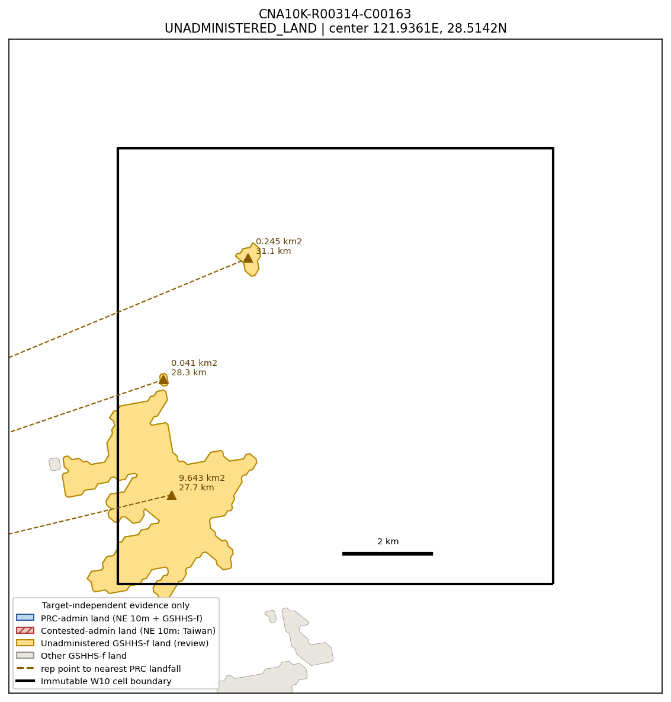 |
| 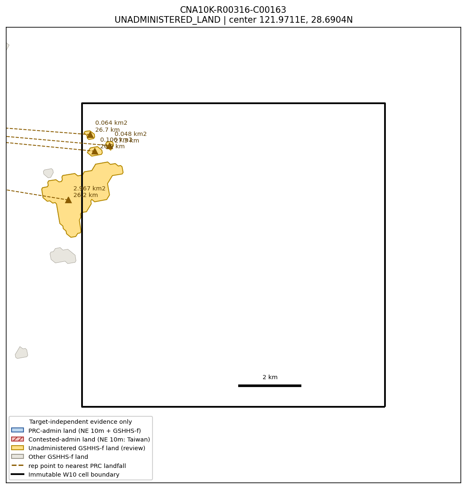 | |

**Why R00283-C00149 is different.** Its 2.890 km² polygon sits at
119.979E, 25.959N, coordinates consistent with the Taiwan-administered
Juguang islands of the Matsu group (formal attribution TODO_VERIFY).
The strictly-nearest-PRC-landfall condition needed for a Chinese
island claim cannot safely be evaluated against a contested group that
Natural Earth omits. Recommendation is therefore REMAIN_PROVISIONAL
pending higher-resolution admin evidence or owner attestation; it must
not silently become a KEEP through the offshore-island extension.

## After sign-off

1. Encode accepted decisions as a versioned v1.1 (never ad-hoc edits).
2. Re-run `scripts/data/national/audit_domain_membership_v1.py`;
   zero provisional cells remain (or an owner-approved residual list).
3. Re-run pytest / ruff / mypy and record the accepting commit in the
   supersession JSON; rename the artifact v1_candidate → v1.
4. Migrate census/event joins to the frozen membership token.
5. Record sign-off against Issue #17, then issue the W10 freeze.
