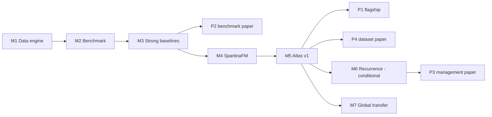

# PUBLICATION_MAP.md

Planned publication architecture for Spartina Earth. This is a **plan**,
not a promise: target venues are decided by the evidence actually
produced. No results in this document exist yet — all numbers in future
manuscripts must come from executed, logged experiments
(see [`../experiments/EXPERIMENT_STANDARD.md`](../experiments/EXPERIMENT_STANDARD.md))
and legacy numbers remain `UNVERIFIED`.

## Planned papers

### P1 — Flagship (M4/M5)

**Working title (draft only).**
*Learning across changing satellites: long-term invasion, eradication and
recurrence dynamics of Spartina alterniflora across coastal China.*

**Story.** A sensor-agnostic multimodal temporal representation (SpartinaFM)
that stays stable across sensor generations and supports a multi-decade
China-coast analysis of invasion expansion, management response, and
post-eradication recurrence, with calibrated uncertainty.

**Evidence required before submission.**
- H1, H3, H4, H6 supported or honestly reported as mixed/negative;
- completed SpartinaShift tracks; fair foundation-model baselines;
- Atlas v1 product with validation against independent labels;
- recurrence analysis only if management records and recurrence labels
  exist (otherwise split into P3 or removed).

**Possible venues (no guarantee; chosen by evidence).** Remote Sensing of
Environment; ISPRS Journal of Photogrammetry and Remote Sensing; IEEE TGRS;
Nature Portfolio journal **only if** the scope and evidence genuinely
warrant it. `TODO_CITATION` for formatting/author lists later.

### P2 — Method/benchmark companion (M3/M4)

**Content.** SpartinaShift benchmark: spatially disjoint cross-region,
cross-year, cross-sensor, historical-sensor, management-shift,
missing-modality, and sparse-temporal tracks; metric suite (pixel,
boundary, patch, area, calibration, change); systematic evaluation of
strong baselines including foundation models; failure-mode analysis.

**Positioning.** Contribution is the benchmark + generalization findings,
independent of whether SpartinaFM itself is novel.

**Possible venues.** TGRS; ISPRS JPRS; RSE benchmark section; NeurIPS
Datasets & Benchmarks style venue if scope fits.

### P3 — Management / recurrence paper (M6, conditional)

**Content.** Post-eradication recurrence detection and early warning,
evaluated with managers on confirmed treatment units; lead time vs. false
alerts; high-risk patch capture.

**Hard precondition.** Verified treatment dates and multi-year recurrence
labels (currently `MISSING` — H8 is blocked). No recurrence claims without
these.

**Possible venues.** RSE; Journal of Environmental Management;
Remote Sensing of Applications; conservation/management journals.

### P4 — Dataset paper: Spartina Atlas (M5, conditional)

**Content.** The long-term China Spartina product: provenance, label
tiers, validation design, uncertainty, per-year/per-region quality,
distribution.

**Hard preconditions.** Complete per-asset license confirmation
(`DATA_LICENSE.md`), independent validation, documented uncertainty;
anonymized cohort/region descriptions where required by collaborators.

**Possible venues.** Scientific Data; Earth System Science Data; RSE.

## Sequencing and dependencies

## Evidence discipline for manuscripts

- Use explicit placeholders, never invented content: `TODO_EXPERIMENT`,
  `TODO_VERIFY`, `TODO_CITATION`.
- Ethics/IRB/data-governance statements: use only the minimal wording
  confirmed by collaborators; otherwise status stays `NOT READY`.
- Do not reveal identifiable institution/site information for sensitive
  field cohorts; use anonymized cohort descriptions per project policy.
- Journal target is finalized only after results and review feedback; no
  venue name appears as a guaranteed target in public material.
- Every reported metric must link to a `run_id` and data manifest version.
